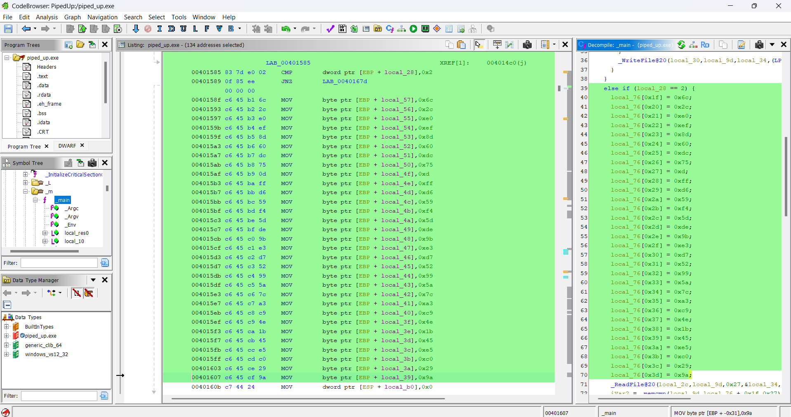
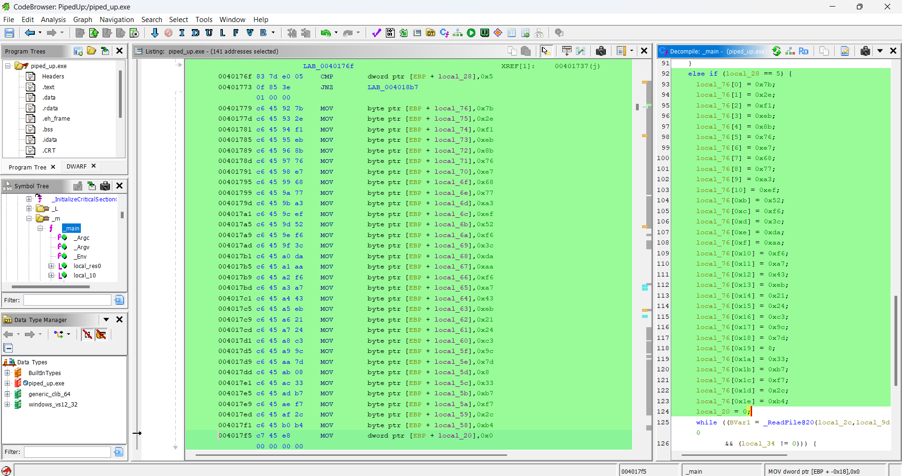
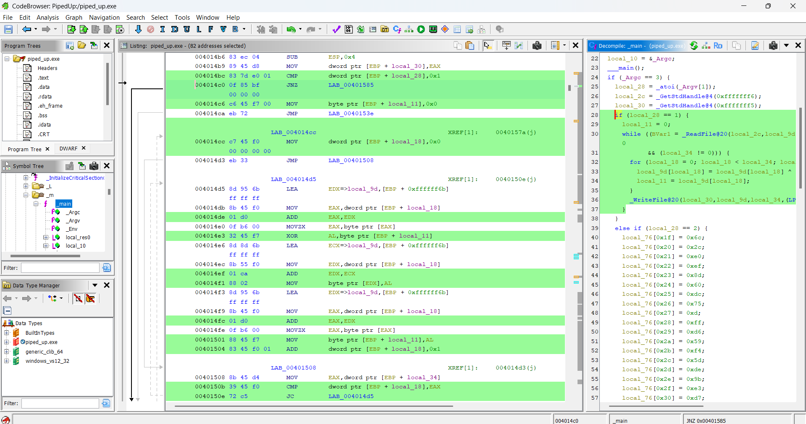
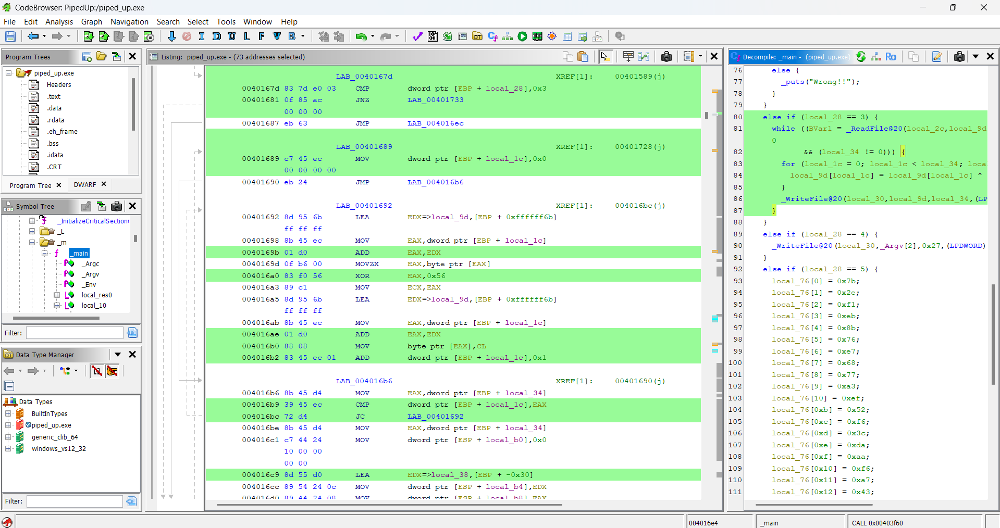

## **Challenge Name: Piped Up**

### **Solves**
- **Solves**: - 46
- **Points**: 300

### **Description**
A sequence of transformations twists and distorts the truth, layer by layer, before it reaches its final destination. By the time it’s checked, the original meaning is deeply buried. Can you trace the pipeline, reverse the modifications, and uncover what was hidden?

### **Approach**

In this challenge, the program creates **five child processes** that communicate through **pipes**. Each process applies a transformation to the data before passing it to the next. The final process checks whether the transformed input matches a **hidden expected value**. Our goal is to reverse these transformations and retrieve the original flag.

1. Extract the **encoded flag**: Using Ghidra, we analyze the ``` if (local_30 == 2) ``` block, which contains a hardcoded array (```local_227```). This array stores the expected encoded flag. [hardcoded array]

```
encoded_flag = [0x99, 0x69, 0x3b, 0xfc, 0x9d, 0x1a, 0xa0, 0x19, 0xd3, 0xa9, 0x87, 0xdd, 0x82, 0xca, 0x61, 0x38,
                0xff, 0x55, 0x5e, 0xce, 0xaf, 0x9c, 0xa6, 0x0d, 0xd3, 0x64, 0x9a, 0xea, 0x27, 0x86, 0x6f, 0x7f,
                0x01, 0xe0, 0xad, 0x48, 0xdd, 0x61, 0x9a]
```
This is the final transformed value after passing through the pipeline. To retrieve the flag, we must undo each transformation in reverse order.

2. Reverse **XOR** with the **key array**: Upon inspecting the ``` if (local_30 == 5) ``` block, ```local_227``` is XORed with another key array. [xor key]

```
key = [0x7b, 0x2e, 0xf1, 0xeb, 0x8b, 0x76, 0xe7, 0x68, 0x77, 0xa3, 0xef, 0x52, 0xf6, 0x3c, 0xda, 0xaa,
       0xf6, 0xa7, 0x43, 0xeb, 0x21, 0x24, 0xc3, 0x9c, 0x7d, 0x8, 0x33, 0xb7, 0xf7, 0x2c, 0xb4]
```

```
xor_reversal = [encoded_flag[i] ^ key[i] for i in range(len(encoded_flag))]
print(xor_reversal)
```

**Output**: ```[23, 2, 17, 4, 6, 22, 59, 29, 122, 92, 57, 11, 2, 97, 4, 49, 21, 112, 17, 114, 123, 88, 96, 85, 51, 19, 118, 82, 55, 5, 46]```

3. Reverse **Cumulative XOR** (Right to Left): In the ``` if (local_30 == 1) ``` block, each byte was XORed with the previous byte from left to right. [cumulative xor]

```
for i in range(len(xor_reversal) - 1, 0, -1):
    xor_reversal[i] ^= xor_reversal[i - 1]
print(xor_reversal)
```

**Output**: ```[23, 21, 19, 21, 2, 16, 45, 38, 103, 38, 101, 50, 9, 99, 101, 53, 36, 101, 97, 99, 9, 35, 56, 53, 102, 32, 101, 36, 101, 50, 43]```

4. Reverse **XOR** with **0x56**: In the ```if (local_30 == 3)``` block, each byte was XORed with 0x56. [xor with 0x56]

```
xor_reversal_1 = [b ^ 0x56 for b in xor_reversal]
print(xor_reversal_1)
```

**Output**: ```[65, 67, 69, 67, 84, 70, 123, 112, 49, 112, 51, 100, 95, 53, 51, 99, 114, 51, 55, 53, 95, 117, 110, 99, 48, 118, 51, 114, 51, 100, 125]```

5. Convert to **String**: Convert the decrypted bytes back to a readable string.

```
flag = "".join(chr(b) for b in xor_reversal_1)
print(flag)
```

### **Flag**
```
ACECTF{p1p3d_53cr375_unc0v3r3d}
```

