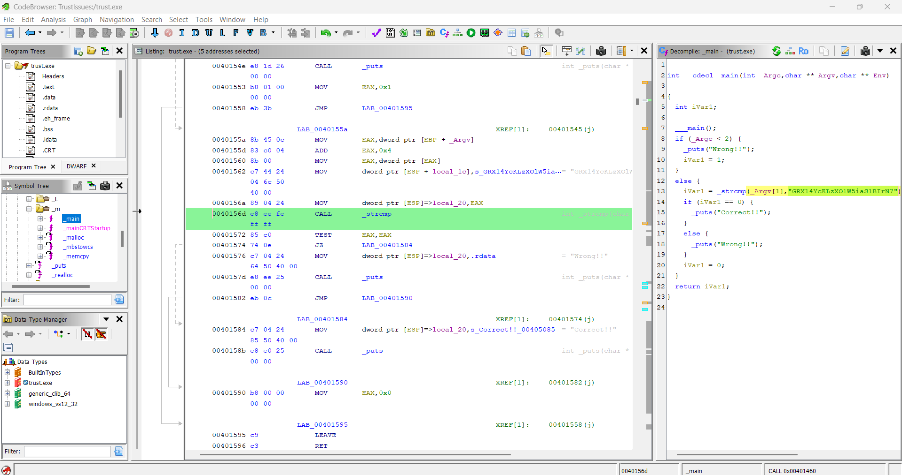
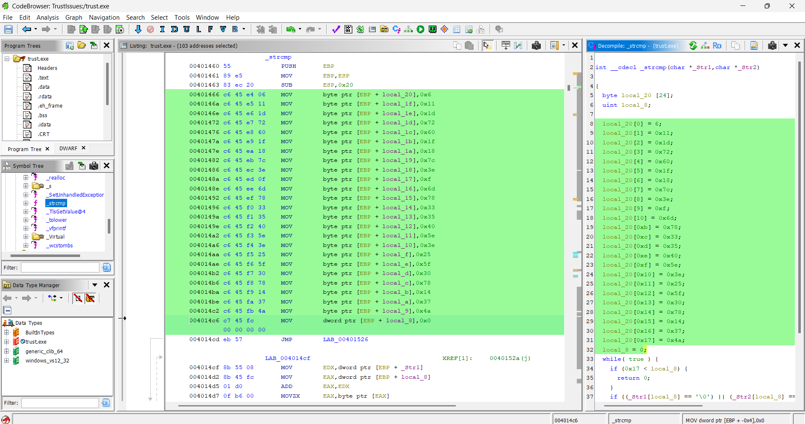

## **Challenge Name: Trust Issues**

### **Solves**
- **Solves**: 145
- **Points**: 200

### **Description**
A program is checking your input against a hidden value, but the comparison is far from straightforward. Something’s been altered to obscure the truth. Your goal is to uncover the transformation behind the check and reveal the original content.

### **Approach**

1. Analyze the binary with **Ghidra**: Open the provided binary trust.exe in Ghidra. In the main function, the program calls a **custom strcmp function (_strcmp)**, comparing the **user input (_Argv[1])** against a hardcoded **string: "GRX14YcKLzXOlW5iaSlBIrN7"** [main function]

2. Investigate the **custom strcmp**: Upon inspecting the disassembled code in Ghidra, we find that this custom strcmp doesn’t perform a simple string comparison. Instead, it modifies the flag using an **XOR operation** with a **secret key** before comparing it. [strcmp function]

3. Extract the **XOR Key**: Inside the custom strcmp function, we trace the code and locate the XOR key. This key is used to modify the flag before the comparison. Extracting the key is crucial for reversing the obfuscation.

```
key = [0x6, 0x11, 0x1d, 0x72, 0x60, 0x1f, 0x18, 0x7c, 0x3e, 0xf, 0x6d, 0x78, 0x33, 0x35, 0x40, 0x5e, 0x3e, 0x25, 0x5f, 0x30, 0x78, 0x14, 0x37, 0x4a]
```

4. **Reverse the XOR** transformation: Once we have the XOR key, we apply the **inverse** of the **XOR** operation on the modified string. This allows us to recover the original flag from the obfuscated input.

```
# The XOR key from local_20[] (extracted from the decompiled strcmp function)
key = [0x6, 0x11, 0x1d, 0x72, 0x60, 0x1f, 0x18, 0x7c, 0x3e, 0xf, 0x6d, 0x78, 0x33, 0x35, 0x40, 0x5e, 0x3e, 0x25, 0x5f, 0x30, 0x78, 0x14, 0x37, 0x4a]

# The string that was compared in the main function
comp_string = "GRX14YcKLzXOlW5iaSlBIrN7"

# Reverse XOR operation to recover the original flag
flag = ''.join(chr(ord(c) ^ key[i]) for i, c in enumerate(comp_string))

print("Flag:", flag)
```

### **Flag**
```
ACECTF{7ru57_bu7_v3r1fy}
```

